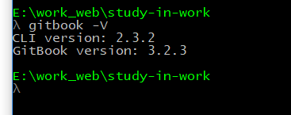

# 准备工作

### 本地安装

在已经安装好NodeJS和NPM的电脑上，通过命令行窗口，输入以下命令安装GitBook：

```linux
$ npm install gitbook-cli -g
```

`gitbook-cli` 是安装和管理GitBook版本库的程序。它会自动安装GitBook所需的模块来创建一本书。

```
$ gitbook -V
```

如果显示gitbook版本号即代表安装成功

