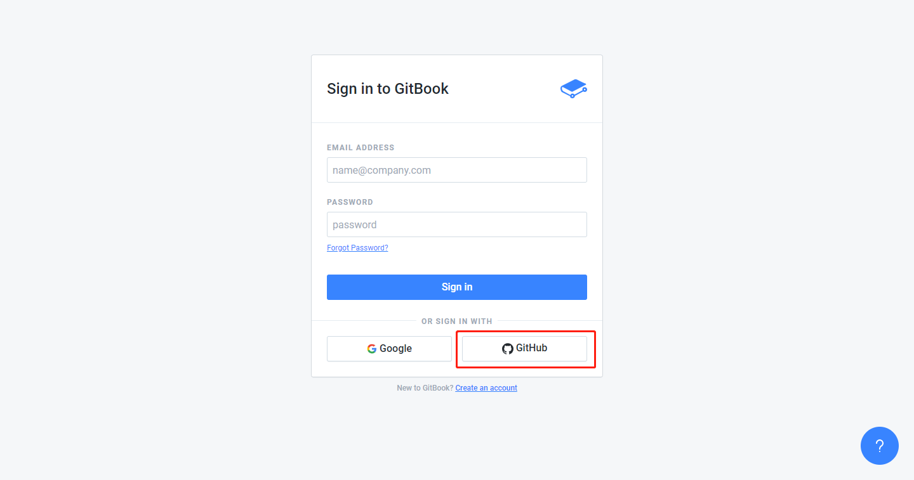
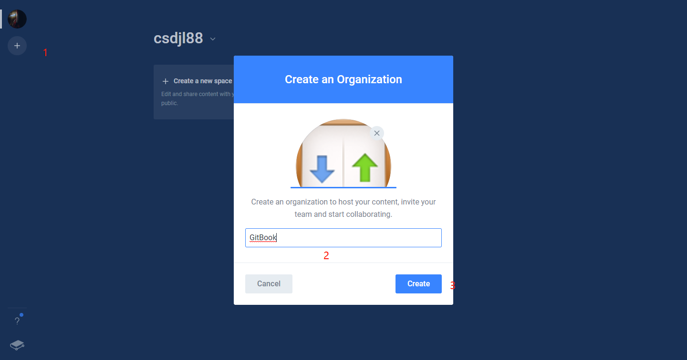
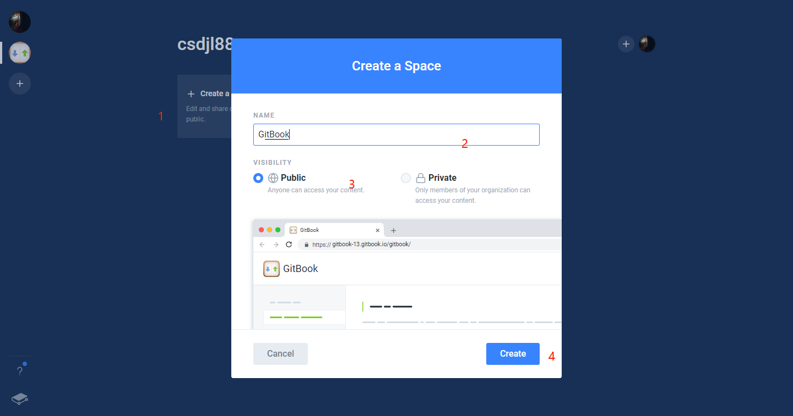
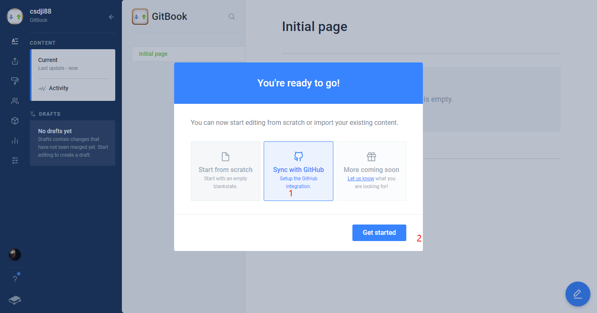
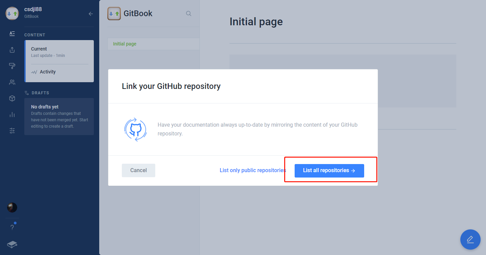
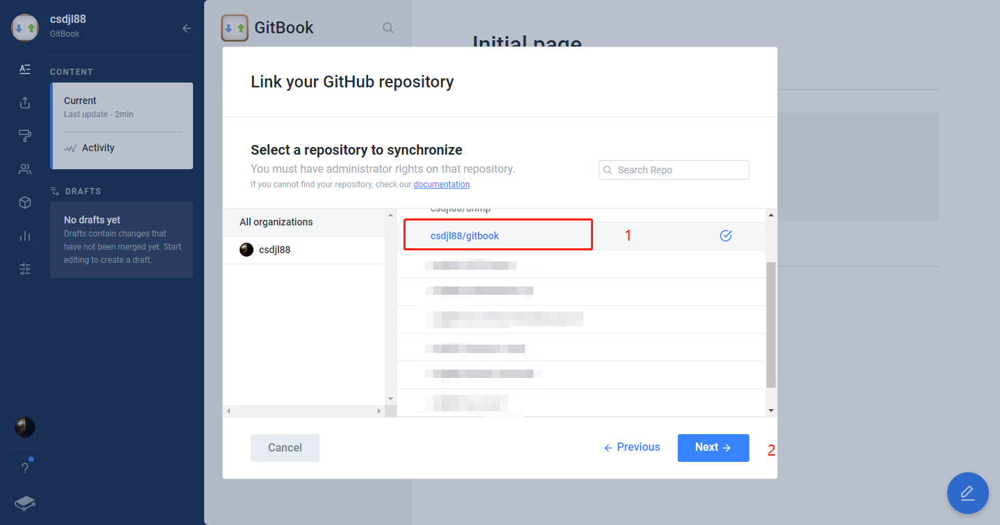
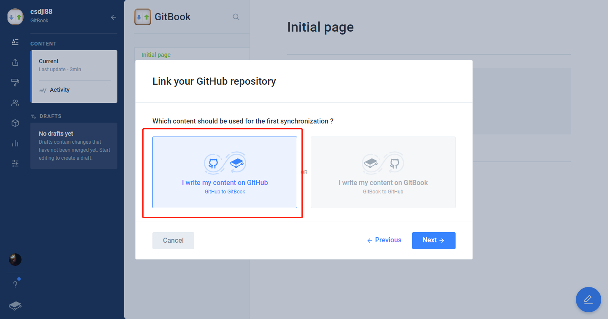
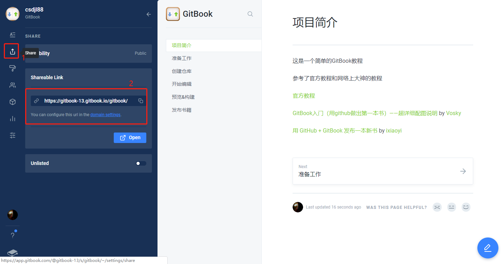
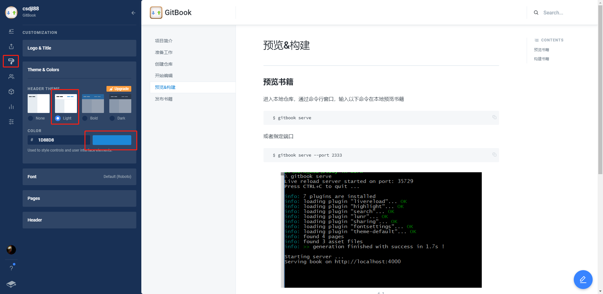

# 发布书籍

登陆[GitBook](https://www.gitbook.com/) 并使用Github账号授权登录

创建一个私人页面，也可以创建团队的

创建一个主题

创建一个空间

从github获取

查看github账户中所有仓库

选择刚刚我们创建的git仓库

选择用master分支同步，也可以用其他。这个看个人喜好

选择同步到来源

等待同步

大功告成！！！同步完成后可以用gitbook的域名分享给你的朋友

更改主题/颜色，可以利用gitbook内置的样式更改文字颜色。其他主题要钱。坑！

