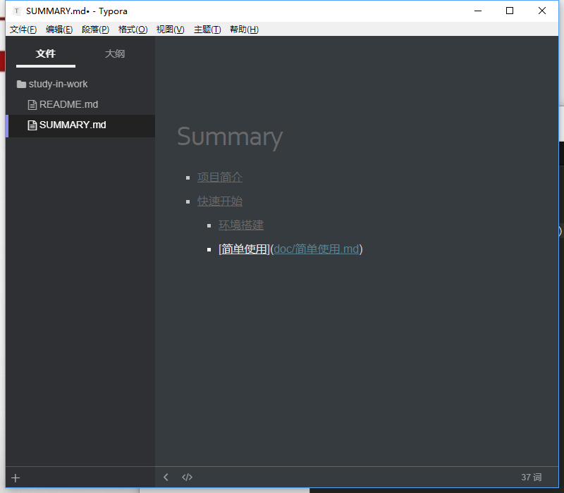

# 开始编辑

初始化 gitbook

进入本地仓库，通过命令行窗口，输入以下命令在当前目录创建一本书

```
$ gitbook init
```

得到2个文件README.md、SUMMARY.md

README.md  书的介绍文字，如前言、简介，在章节中也可做为章节的简介

SUMMARY.md 定制书籍的章节结构和顺序

# 编辑目录

## 辅助软件

Markdown是GitBook的默认解析器，所以为了快速编辑，借助下Markdown编辑器，当然要是你已经熟悉Markdown的语法的话，txt也是能编辑的。

这里选用了 [Typora](https://typora.io/) 

因为这个软件所见即所得，实时渲染Markdown

用Typora打开仓库文件夹编辑SUMMARY.md文件

`SUMMARY.md`中`[]`内的内容是标题，`()`内是文档的路径，章节和子章节用四个空格或者`tab`键来分级。



再次进入本地仓库，通过命令行窗口，输入以下命令

```
$ gitbook init
```

gitbook就会根据`SUMMARY.md`生成对应的文件夹，以及对应的文件

注意： gitbook init 只支持生成两级目录

或者直接新建文件XXX.md，然后在目录文件指向。这样就不用反复去init GitBook

然后就在对应的文件编辑你的书籍，可以在 Typora 的辅助下快速编辑

