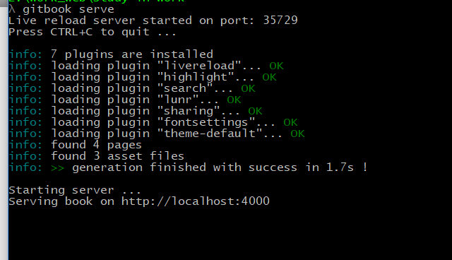

# 预览书籍

进入本地仓库，通过命令行窗口，输入以下命令在本地预览书籍

```
$ gitbook serve
```

或者指定端口

```
$ gitbook serve --port 2333
```



用浏览器打开 http://localhost:4000

# 构建书籍

```
$ gitbook build
```

也可以生成 PDF、ePub、Mobi，但是要有插件支持

这里的最终效果是发布在gitbook上，故不展开说明。要是有兴趣的朋友，可以参考下[官方文档](http://gitbook.hushuang.me/ebook.html)的详细说明

